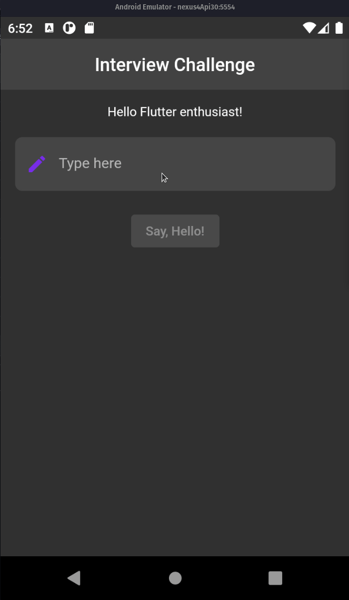

<!-- header section -->
<p align="center">
  <br/>
  <span><b>Say, Hello! 👋🏿 </b></span><br/>
</p>
<!-- header section END -->

<br/>

<!-- show case/gif section -->



<!-- show case/gif section END -->

<!-- about app and course section -->

## About this App 🗣

This app was developed from a challenge, for more information, read [this document](CHALLENGER.md).
<br/>
in this app, you type a value in the TextField and its return will be `"Hello $yourEnteredValue"`.

As for what can be typed into the TextField, consider that:
<br/>
- Numbers are not allowed;
<br/>
- Special characters are not allowed;
<br/>
- Only blank spaces are not allowed;
<br/>
- Letters [A-Z] are allowed;
<br/>

## Running the project locally 🗣
1. Clone this repository into your machine:

```bash
git clone https://github.com/samuelematias/say_hello
```
2. With the repository cloned, open the repository root in your terminal and run the command:

```bash
flutter pub get
```
With FVM:

```bash
fvm flutter pub get
```
3. Everything working fine, without any errors, run the app with the following command:

```bash
flutter run
```
With FVM:

```bash
fvm flutter run
```

4. Have fun!

## Tech Stack 👩🏾‍💻

> 💪 Building with sound null safety 💪

- [Dart - 2.16.1](https://dart.dev/)
- [Flutter - 2.10.3](https://flutter.dev/)
 
> Aren't you in this Flutter/Dart vesion? Consider taking a look at [FVM](https://fvm.app/), I believe it can help you at this point 😉.

## Plugins 📟

- [equatable](https://pub.dev/packages/equatable)
- [flutter_bloc](https://pub.dev/packages/flutter_bloc)
- [bloc_test](https://pub.dev/packages/bloc_test)
- [mocktail](https://pub.dev/packages/mocktail)
- [very_good_analysis](https://pub.dev/packages/very_good_analysis)

## Tools 🛠

- [hover](https://github.com/go-flutter-desktop/hover)

## About me

<!-- ALL-CONTRIBUTORS-LIST:START - Do not remove or modify this section -->
<!-- prettier-ignore -->
<table>
  <tr>
    <td align="center"><a href="https://twitter.com/samuelematias"><br /><sub><b>Samuel Matias</b></sub></a><br /><a href="https://github.com/samuelematias"title="Code">💻</a><a href="https://github.com/samuelematias"title="Design"> 🎨</a></td></td>
</table>

<!-- ALL-CONTRIBUTORS-LIST:END -->

<!-- about app and course section END -->
